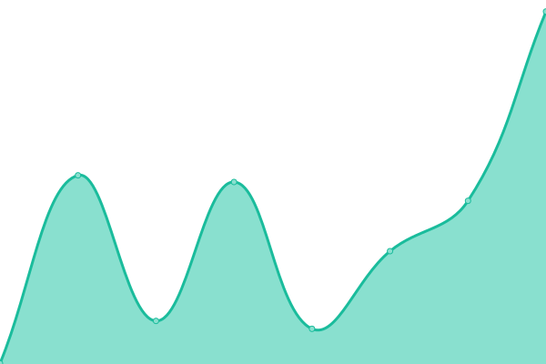

# [📈 Live Status](https://niubidale.github.io/upptime): <!--live status--> **🟧 Partial outage**

This repository contains the open-source uptime monitor and status page for [niubidale](https://niubidale.github.io/upptime), powered by [Upptime](https://github.com/upptime/upptime).

With [Upptime](https://upptime.js.org), you can get your own unlimited and free uptime monitor and status page, powered entirely by a GitHub repository. We use [Issues](https://github.com/niubidale/upptime/issues) as incident reports, [Actions](https://github.com/niubidale/upptime/actions) as uptime monitors, and [Pages](https://niubidale.github.io/upptime) for the status page.

<!--start: status pages-->
<!-- This summary is generated by Upptime (https://github.com/upptime/upptime) -->
<!-- Do not edit this manually, your changes will be overwritten -->
<!-- prettier-ignore -->
| URL | Status | History | Response Time | Uptime |
| --- | ------ | ------- | ------------- | ------ |
|  [Google](https://www.google.com) | 🟩 Up | [google.yml](https://github.com/niubidale/upptime/commits/HEAD/history/google.yml) | 

 80ms
     
 | 

<a href="https://niubidale.github.io/upptime/history/google">100.00%</a>
    

|  [Whoogle-heroku](https://laisou.herokuapp.com) | 🟥 Down | [whoogle-heroku.yml](https://github.com/niubidale/upptime/commits/HEAD/history/whoogle-heroku.yml) | 

 289ms
     
 | 

<a href="https://niubidale.github.io/upptime/history/whoogle-heroku">0.00%</a>
    

|  [Whoogle](http://152.70.95.232:2095) | 🟥 Down | [whoogle.yml](https://github.com/niubidale/upptime/commits/HEAD/history/whoogle.yml) | 

 0ms
     
 | 

<a href="https://niubidale.github.io/upptime/history/whoogle">0.00%</a>
    

|  [Whoogle CDN](https://s.100cc.fun) | 🟥 Down | [whoogle-cdn.yml](https://github.com/niubidale/upptime/commits/HEAD/history/whoogle-cdn.yml) | 

 0ms
     
 | 

<a href="https://niubidale.github.io/upptime/history/whoogle-cdn">0.00%</a>
    

|  [Google image](http://so.100cc.fun) | 🟥 Down | [google-image.yml](https://github.com/niubidale/upptime/commits/HEAD/history/google-image.yml) | 

 0ms
     
 | 

<a href="https://niubidale.github.io/upptime/history/google-image">0.00%</a>
    

|  [Google image CDN](https://go.100cc.fun) | 🟥 Down | [google-image-cdn.yml](https://github.com/niubidale/upptime/commits/HEAD/history/google-image-cdn.yml) | 

 0ms
     
 | 

<a href="https://niubidale.github.io/upptime/history/google-image-cdn">0.00%</a>
    

<!--end: status pages-->

[**Visit our status website →**](https://niubidale.github.io/upptime)

## 📄 License

- Powered by: [Upptime](https://github.com/upptime/upptime)
- Code: [MIT](./LICENSE) © [niubidale](https://niubidale.github.io/upptime)
- Data in the `./history` directory: [Open Database License](https://opendatacommons.org/licenses/odbl/1-0/)
